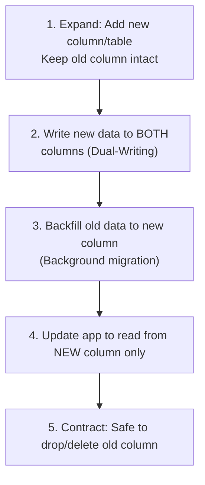

# Database Migration & Evolution Skill

This skill teaches the coding agent how to safely evolve database schemas, write migrations, and write idempotent database seeds. It applies whenever the project schema is modified or expanded, or when migration files need to be generated and applied.

---

## 1. Schema Change Strategy (Expand & Contract)

When modifying schemas in a live environment, **never** make destructive changes (like renaming or deleting columns/tables) in a single deploy. Doing so will break the running server instance before the new code is fully rolled out.

Always follow the **Expand and Contract (Parallel Change)** pattern:



### Safe vs. Unsafe Changes

| Change Type | Safety Status | Safe Alternative / Rule |
| :--- | :--- | :--- |
| **Add nullable column** | ✅ Safe | Safe to deploy immediately. |
| **Add column with default** | ✅ Safe | Safe to deploy immediately. |
| **Add NOT NULL column (no default)** | ❌ Unsafe | Add as nullable first, deploy, backfill values, alter column to `NOT NULL`. |
| **Rename a column** | ❌ Unsafe | Add new column, dual-write to both, backfill old data, switch reads to new column, drop old. |
| **Drop a column** | ❌ Unsafe | Ensure no running code accesses the column. Remove all references in code first, deploy, then drop column. |
| **Create index** | ⚠️ Risky | On large databases (e.g. PostgreSQL), use `CREATE INDEX CONCURRENTLY` to avoid locking writes. |

---

## 2. ORM-Specific Playbooks

Ensure you follow the exact conventions and commands of the chosen ORM declared in `SPEC.md`.

### 2.1 Prisma ORM (TypeScript/Node)
Prisma uses a declarative `schema.prisma` file to represent target schema states.

* **Development (Local Schema Changes)**:
  1. Modify `prisma/schema.prisma`.
  2. Run `npx prisma migrate dev --name <migration_name>` to generate and apply the SQL migration locally.
  3. Validate that `prisma/client` is re-generated automatically.
* **Production / Docker CI/CD**:
  * Run `npx prisma migrate deploy` during the startup phase of the backend container.
  * **Rule**: Never run `migrate dev` in production as it can reset the database.
* **Gotchas**:
  * If using PostgreSQL, verify the provider url uses `postgresql://` (not `postgres://`).

### 2.2 Drizzle ORM (TypeScript/Node)
Drizzle uses TypeScript schema files to represent tables.

* **Development (Local Schema Changes)**:
  1. Modify your table schemas in `src/db/schema.ts` (or equivalent location).
  2. Run `npx drizzle-kit generate` to generate the SQL migration script in `drizzle/migrations/`.
  3. Run `npx drizzle-kit migrate` (or run a custom migration script) to apply the generated SQL.
  4. In rapid prototyping only, use `npx drizzle-kit push` to bypass migration file generation. Avoid using this once in production track.
* **Drizzle Config**:
  * Ensure `drizzle.config.ts` points to the correct migration folder and reads connection variables via `process.env`.

### 2.3 SQLAlchemy + Alembic (Python)
SQLAlchemy defines python model classes; Alembic tracks changes.

* **Development (Local Schema Changes)**:
  1. Modify model definitions in your Python modules.
  2. Run `alembic revision --autogenerate -m "description"` to generate the migration script in `alembic/versions/`.
  3. **Mandatory**: Open the generated migration script and double-check it. Alembic autodetect can miss renamed columns or custom index updates.
  4. Run `alembic upgrade head` to apply changes.
* **Gotchas**:
  * Verify that new models are imported inside `env.py` under Alembic configurations so that Alembic's `target_metadata` can detect them.

### 2.4 Django ORM (Python)
Django includes a built-in migration management system.

* **Development (Local Schema Changes)**:
  1. Modify model classes in `models.py`.
  2. Run `python manage.py makemigrations` to generate migration files.
  3. Run `python manage.py migrate` to apply migrations.
* **Data Migrations (Non-structural changes)**:
  * To migrate or backfill data, create an empty migration (`python manage.py makemigrations --empty <app_name>`) and write python code using the `RunPython` action.

---

## 3. Idempotent Database Seeding

Seeding must be **idempotent** (running the seed script multiple times should not cause duplicate records, key conflicts, or schema integrity violations).

### Seeding Rules

1. **Use Upsert Operations**:
   * **Prisma**: Use `db.model.upsert()` instead of `db.model.create()`.
   * **SQLAlchemy / SQL**: Use `INSERT INTO ... ON CONFLICT DO UPDATE` or query existing records before inserting.
   * **Django**: Use `get_or_create()` or `update_or_create()`.
2. **Order of Insertion (Relational Dependencies)**:
   * Always seed parent records first.
   * Seed lookup/reference codes first (e.g. Roles, Categories).
   * Seed intermediate tables (e.g., UserProfiles, Subscriptions) next.
   * Seed child records (e.g. Orders, Logs) last.
3. **Never Hardcode IDs for Auto-Incrementing Databases**:
   * If a table uses auto-incrementing integer IDs, let the database assign them. Query them back if you need foreign key references, or use natural unique keys (e.g. email, slug) for lookups.

### Example: Idempotent Prisma Seed

```typescript
import { PrismaClient } from '@prisma/client';
const prisma = new PrismaClient();

async function main() {
  // 1. Seed lookup data
  const adminRole = await prisma.role.upsert({
    where: { name: 'ADMIN' },
    update: {},
    create: { name: 'ADMIN', description: 'System Administrator' },
  });

  const userRole = await prisma.role.upsert({
    where: { name: 'USER' },
    update: {},
    create: { name: 'USER', description: 'Standard User' },
  });

  // 2. Seed dependent records using role IDs
  await prisma.user.upsert({
    where: { email: 'admin@system.local' },
    update: { roleId: adminRole.id },
    create: {
      email: 'admin@system.local',
      name: 'System Admin',
      passwordHash: '$2b$10$UniquelyHashedAdminPassword', // Mocked hash
      roleId: adminRole.id,
    },
  });
}

main()
  .catch((e) => {
    console.error(e);
    process.exit(1);
  })
  .finally(async () => {
    await prisma.$disconnect();
  });
```

---

## 4. Checklist: Reviewing a Database Schema Change

Before committing a migration or schema file, verify the following:

- [ ] Does this change preserve data safety? (Will it crash production? If yes, split into expand/contract stages)
- [ ] Are all foreign keys mapped with appropriate delete constraints (`ON DELETE CASCADE` or `SET NULL`)?
- [ ] Are performance-critical filter/query columns indexed?
- [ ] Is there an idempotent seed updated to reflect the new models/columns?
- [ ] Does the migration run successfully locally from scratch? (Test by resetting: e.g. `npx prisma migrate reset` or running migrations on a clean docker db container)

---

## 5. MySQL-Specific Migration Gotchas

When SPEC.md Section 4 declares `MySQL` as the database, be aware of these MySQL-specific behaviors that differ from PostgreSQL.

### 5.1 `ALTER TABLE` Locks the Entire Table

Unlike PostgreSQL's `CREATE INDEX CONCURRENTLY`, MySQL's `ALTER TABLE` acquires a **full table lock** during structural changes. On large tables (>1M rows), this blocks all reads and writes.

| Operation | Risk | Safe Alternative |
|:---|:---|:---|
| `ADD COLUMN NOT NULL` (no default) | 🔴 Table lock + data backfill | Add as `NULL` first, backfill, then `ALTER` to `NOT NULL` |
| `ADD INDEX` on large table | 🟡 Partial lock | Use `CREATE INDEX` in a maintenance window or `pt-online-schema-change` |
| `DROP COLUMN` | 🟡 Table lock | Confirm no code reads it, then drop |
| `CHANGE COLUMN` (rename) | 🔴 Full copy | Use expand-and-contract; never rename directly |
| `ADD COLUMN` with default | 🟢 Instant (MySQL 8.0+) | Instant DDL supported for nullable + default |

**Tool**: For zero-downtime migrations on MySQL, use [`pt-online-schema-change`](https://www.percona.com/doc/percona-toolkit/3.0/pt-online-schema-change.html) or [`gh-ost`](https://github.com/github/gh-ost).

### 5.2 MySQL Does Not Have a `BOOLEAN` Type

MySQL stores `BOOLEAN` as `TINYINT(1)`. SQLAlchemy handles this transparently with `Column(Boolean)`, but raw SQL migrations must use `TINYINT(1)`:

```sql
-- ✅ Correct MySQL boolean column
ALTER TABLE users ADD COLUMN is_active TINYINT(1) NOT NULL DEFAULT 1;

-- ❌ This works in MySQL 8 but is an alias for TINYINT — don't assume it's a true bool
ALTER TABLE users ADD COLUMN is_active BOOLEAN NOT NULL DEFAULT TRUE;
```

In SQLAlchemy Alembic migrations:
```python
# ✅ SQLAlchemy automatically maps Boolean → TINYINT(1) for MySQL
op.add_column('users', sa.Column('is_active', sa.Boolean(), nullable=False, server_default='1'))
```

### 5.3 `CREATE INDEX CONCURRENTLY` Does NOT Exist in MySQL

PostgreSQL supports non-locking concurrent index creation. MySQL does NOT. The `CONCURRENTLY` keyword in the db-migration skill Section 1 is **PostgreSQL only**.

```sql
-- ✅ PostgreSQL (non-locking)
CREATE INDEX CONCURRENTLY idx_users_email ON users(email);

-- ✅ MySQL 8.0+ (online DDL — less locking, but still some impact on large tables)
ALTER TABLE users ADD INDEX idx_users_email (email), ALGORITHM=INPLACE, LOCK=NONE;

-- ❌ MySQL — this will error
CREATE INDEX CONCURRENTLY idx_users_email ON users(email);
```

### 5.4 JSON Columns in MySQL

MySQL 8.0+ supports native JSON columns, but querying differs from PostgreSQL:

```sql
-- MySQL JSON query syntax
SELECT * FROM users WHERE JSON_EXTRACT(metadata, '$.role') = 'admin';

-- PostgreSQL JSONB query syntax (different!)
SELECT * FROM users WHERE metadata->>'role' = 'admin';
```

In SQLAlchemy:
```python
# Works for both PostgreSQL and MySQL:
from sqlalchemy import Column, JSON
metadata = Column(JSON)

# MySQL-specific JSON path query in SQLAlchemy:
from sqlalchemy import func
result = await db.execute(
    select(User).where(func.json_extract(User.metadata, "$.role") == "admin")
)
```

### 5.5 Alembic Auto-detect with MySQL Charset

Alembic may generate spurious `ALTER TABLE ... CHARSET` changes when comparing MySQL tables. Suppress this by setting `compare_type=True` and `compare_server_default=True` in `env.py`:

```python
# alembic/env.py — in configure() call
context.configure(
    connection=connection,
    target_metadata=target_metadata,
    compare_type=True,
    compare_server_default=True,
    # Suppress MySQL charset noise:
    include_schemas=False,
    render_as_batch=False,  # batch mode is SQLite-only
)
```

### 5.6 Seeding with MySQL AUTO_INCREMENT

MySQL's `AUTO_INCREMENT` does not reset when rows are deleted. Never hardcode IDs in seed scripts — always use natural unique keys (email, slug, code) for upsert lookups:

```python
# ✅ CORRECT: idempotent MySQL seed using SQLAlchemy
from sqlalchemy.dialects.mysql import insert as mysql_insert

async def seed_roles(db: AsyncSession):
    roles = [
        {"name": "admin", "description": "System Administrator"},
        {"name": "viewer", "description": "Read-only access"},
    ]
    stmt = mysql_insert(Role).values(roles)
    # ON DUPLICATE KEY UPDATE — MySQL's equivalent of ON CONFLICT DO UPDATE
    stmt = stmt.on_duplicate_key_update(description=stmt.inserted.description)
    await db.execute(stmt)
    await db.commit()
```

